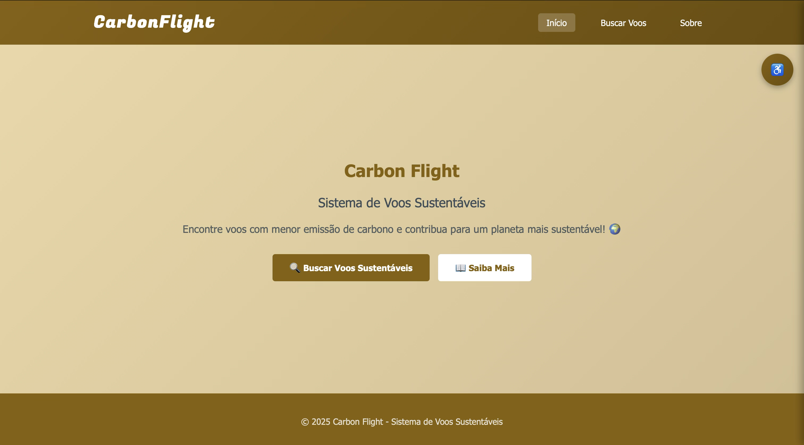
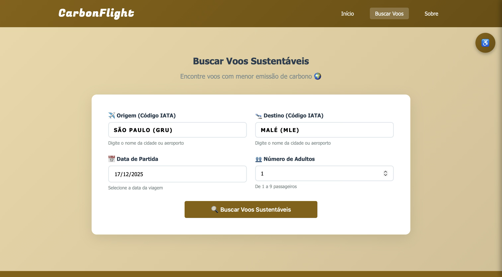
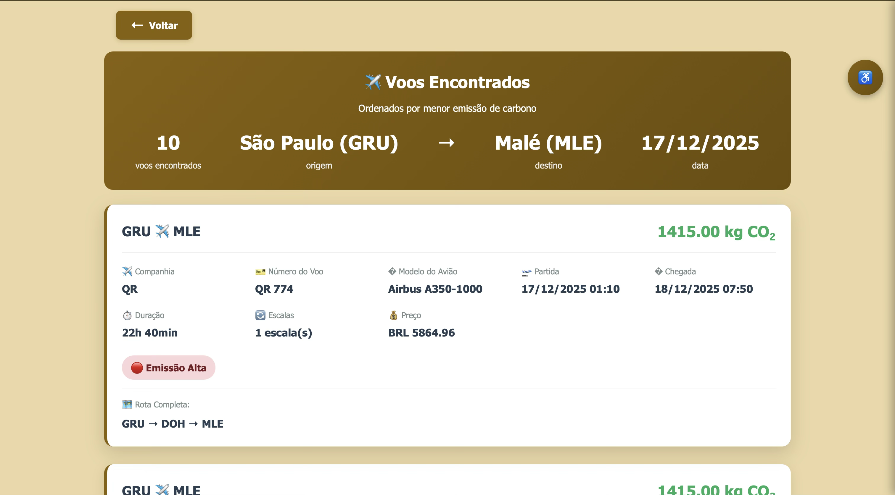
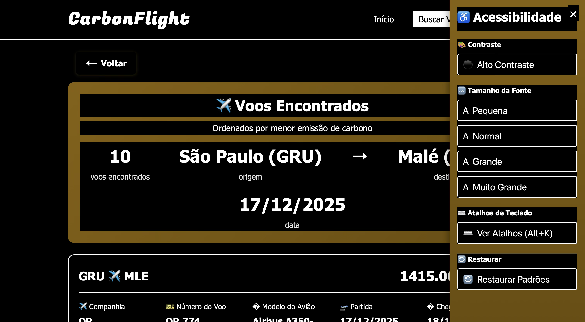

# CarbonFlight


---

## Overview

CarbonFlight allows users to compare flight routes based on their estimated CO₂ emissions.
The system retrieves flight information, builds a graph representing possible routes, and identifies the path with the **lowest carbon emission**.

---

## Technologies Used

### Back-end

* **Java**
* **Spring Boot**
* **Thymeleaf**
* **Amadeus API** for flight and emission data

### Front-end

* **HTML**
* **CSS**
* **JavaScript**

### Other Concepts

* Directed weighted graphs
* CO₂ emission estimation models
* Accessibility tools for web interfaces

---

## How It Works

### 1. Graph Construction

For every user request, the system generates a new **directed weighted graph**, where:

* **Vertices** → airports
* **Edges** → routes between airports
* **Edge weight** → carbon emission of the route

To build this graph, the system fetches real-time data from the **Amadeus API**, including:

* CO₂ emission (when available)
* Flight time
* Connections
* Layover time
* Ticket price
* Aircraft model
* Airline
* Additional flight details

All retrieved data is displayed to the user.

---

## Emission Calculation Methods

Since some airlines do not publicly provide CO₂ emission data, the system uses three fallback strategies:

### 1. Direct API data (preferred)

If the Amadeus API provides the emission value, that data is used directly.

---

### 2. Calculation based on aircraft model

If emission data is missing but the **aircraft model** is known:

* We maintain a database of aircraft models and their efficiency.
* Using the fuel burn rate per kilometer (sourced from **ICAO**).
* Using the CO₂ emission factor per kg of fuel burned (based on Brazilian government documentation).
* We divide the fuel consumption by the total passenger capacity.
* We multiply this efficiency factor by the route distance to estimate total emissions.

This produces a fairly accurate estimation.

---

### 3. Distance-based average emission formula

If neither emission nor aircraft model data is available:

A fallback formula estimates emissions using average CO₂ factors based on distance brackets:

* **< 1500 km**
* **1500–4000 km**
* **> 4000 km**

In practice, this fallback was **never needed** in our tests.

---

## Front-end and User Experience

The interface was designed to be **simple, functional, and accessible**.
We implemented:

* Adjustable text size
* High-contrast mode
* Keyboard navigation shortcuts
* Clean and responsive layout

The front-end communicates with the back-end using **Spring Boot + Thymeleaf**, enabling dynamic rendering of flight data and results.

---

## API References

* **Amadeus API:** [https://developers.amadeus.com/](https://developers.amadeus.com/)
* **Brazilian Ministry of Science & Technology — CO₂ Document:**
  [https://repositorio.mcti.gov.br/bitstream/mctic/5306/1/2020_setor_energia_subsetor_queima_combustiveis_fosseis_categoria_aviacao_civil.pdf](https://repositorio.mcti.gov.br/bitstream/mctic/5306/1/2020_setor_energia_subsetor_queima_combustiveis_fosseis_categoria_aviacao_civil.pdf)
* **ICAO — Fuel & Emissions Methodology:**
  [https://icec.icao.int/Home/Methodology](https://icec.icao.int/Home/Methodology)

---

## Project Goal

To provide users with an informed choice by identifying the **route with the lowest carbon footprint**, using the best available data and scientifically backed estimation models.

---
## Screenshots

### Home Screen



### Search



### Results



### accessibility



---

## How to Run - CarbonFlight

## 📋 Index

1. How to Create an Amadeus API Key
2. How to Compile the Code
3. How to Run on Localhost (Web Interface)
4. How to Run in the Console

---

## 1. How to Create an Amadeus API Key

### Step 1: Create an Account

1. Go to: [https://developers.amadeus.com/register](https://developers.amadeus.com/register)
2. Fill in your information (name, email, password)
3. Confirm your email

### Step 2: Create an Application

1. Log in at: [https://developers.amadeus.com/login](https://developers.amadeus.com/login)
2. Click **"Create new app"**
3. Give it a name (e.g., “CarbonFlight”)
4. Click **"Create"**

### Step 3: Copy Your Keys

You will see two keys:

* **API Key**
* **API Secret**

### Step 4: Configure the Project

Create a `.env` file in the root folder and insert your keys:

```env
AMADEUS_API_KEY=your_api_key_here
AMADEUS_API_SECRET=your_api_secret_here
```

---

## 2. ⚙️ How to Compile the Code

### Option 1: Compile Only

```bash
mvn clean compile
```

---

## 3. How to Run on Localhost (Web Interface)

### Method 1: Using Maven (Recommended)

```bash
mvn spring-boot:run
```

### Accessing the Application

1. Open your browser
2. Go to: **[http://localhost:8080](http://localhost:8080)**
3. Click **"Search Flights"**
4. Fill in the form and search for flights!

### How to Stop the Application

* Press `Ctrl + C` in the terminal

### Common Issues

**Port 8080 already in use?**

```bash
lsof -i :8080
kill -9 PID
```

**Browser cache issues?**

* `Ctrl + Shift + R` (Windows/Linux)
* `Cmd + Shift + R` (Mac)

---

## 4. How to Run in the Console

### Option 1: Using Maven

```bash
mvn exec:java -Dexec.mainClass="codigo.main"
```

### Option 2: Compile and Run Manually

```bash
mvn clean compile
java -cp target/classes codigo.main
```

---

## Command Summary

| Action            | Command                                        |
| ----------------- | ---------------------------------------------- |
| Compile           | `mvn compile`                                  |
| Clean and compile | `mvn clean compile`                            |
| Run web interface | `mvn spring-boot:run`                          |
| Run in console    | `mvn exec:java -Dexec.mainClass="codigo.main"` |
| Create JAR        | `mvn clean package`                            |
| Check port 8080   | `lsof -i :8080`                                |
| Stop application  | `Ctrl + C`                                     |


## Authors

* [Francisco Losada](https://github.com/LosadaT)
* [Pedro Moreiras](https://github.com/Pepeu31)
